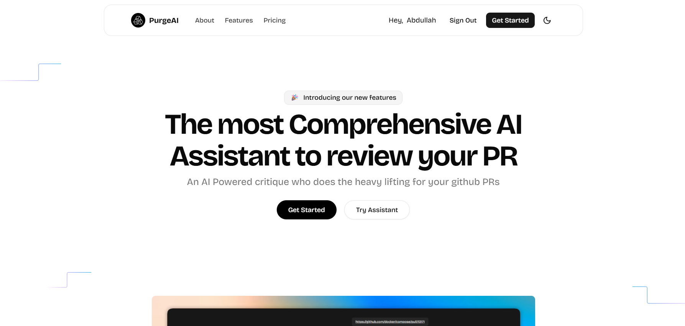

# PurgeAI

PurgeAI is a battle-tested AI assistant designed and developed to help developers manage and review their Pull Requests efficiently. Built with modern technologies, it offers an intelligent, secure, and developer-friendly interface for code review and PR management.

## ✨ Features

- ⚡ **Blazingly Fast** - Lightning-fast performance with optimized algorithms and instant response times
- 🔒 **Secure by Default** - Enterprise-grade security with end-to-end encryption and advanced threat protection
- 🎨 **Customizable** - Flexible modes and personalized insights tailored to your unique workflow
- 👨‍💻 **Developer Friendly** - Clean APIs, comprehensive documentation, and excellent developer experience
- 🧠 **Optimized Context** - Advanced context management for lengthy conversations with intelligent content optimization
- 💳 **Credit-Based System** - Manage usage with a flexible credit system and payment integration
- 🔐 **Secure Authentication** - Robust auth system powered by Better Auth

## 🛠️ Tech Stack

### Frontend
- [Next.js 15](https://nextjs.org/) - React framework with Turbopack
- [Tailwind CSS v4](https://tailwindcss.com/) - Utility-first CSS framework
- [shadcn/ui](https://ui.shadcn.com/) - Beautiful UI components
- [Zustand](https://github.com/pmndrs/zustand) - State management
- [TanStack Query](https://tanstack.com/query) - Data fetching and caching
- [Motion](https://motion.dev/) - Animations

### Backend
- [Express.js](https://expressjs.com/) - Node.js web framework
- [Prisma](https://www.prisma.io/) - Database ORM
- [Better Auth](https://www.better-auth.com/) - Authentication framework
- [Google AI SDK](https://sdk.vercel.ai/) - AI integration
- [Razorpay](https://razorpay.com/) - Payment gateway

### Infrastructure
- [Docker](https://www.docker.com/) - Containerization
- [Vercel](https://vercel.com/) - Deployment platform
- [pnpm](https://pnpm.io/) - Package manager

## 🚀 Getting Started

### Prerequisites

- Node.js 20+
- pnpm 10.17.0+
- Docker (optional)

### Installation

1. Clone the repository:
```bash
git clone <repository-url>
cd purge.ai
```

2. Install dependencies:
```bash
pnpm install
```

3. Set up environment variables:
   - Copy `server/.env.example` to `server/.env` and fill in the values
   - Copy `client/config/config.example.ts` to `client/config/config.ts` and configure

4. Run database migrations:
```bash
cd server
pnpm prisma migrate dev
```

### Development

Run the client (Next.js with Turbopack):
```bash
pnpm client
```

Run the server (Express with hot reload):
```bash
pnpm serv
```

### Docker Deployment

Build and run with Docker Compose:
```bash
docker-compose up --build
```

The application will be available at:
- Client: http://localhost:3000

## 📁 Project Structure

```
purge.ai/
├── client/                 # Next.js frontend
│   ├── app/               # App router pages
│   ├── components/        # React components
│   ├── constants/         # Constants and configuration
│   ├── lib/               # Utility functions
│   ├── store/             # Zustand stores
│   └── public/            # Static assets
├── server/                # Express.js backend
│   ├── api/               # API routes
│   ├── prisma/            # Database schema and migrations
│   ├── routes/            # Route handlers
│   └── schemas/           # Validation schemas
└── docker/                # Docker configurations
```

## 🔧 Available Scripts

- `pnpm client` - Start client development server
- `pnpm serv` - Start server development server
- `pnpm server-img` - Build server Docker image
- `pnpm test` - Run linting

## 🔒 Security

- End-to-end encryption for sensitive data
- CSRF protection
- Secure cookie handling
- Helmet.js for security headers
- Input validation with Zod

## 🤝 Contributing

Contributions are welcome! Please feel free to submit a Pull Request.

1. Fork the repository
2. Create your feature branch (`git checkout -b feature/AmazingFeature`)
3. Commit your changes (`git commit -m 'Add some AmazingFeature'`)
4. Push to the branch (`git push origin feature/AmazingFeature`)
5. Open a Pull Request

## 📝 License

This project is licensed under the ISC License.

## 👤 Author

**Abdullah Mukri**

---